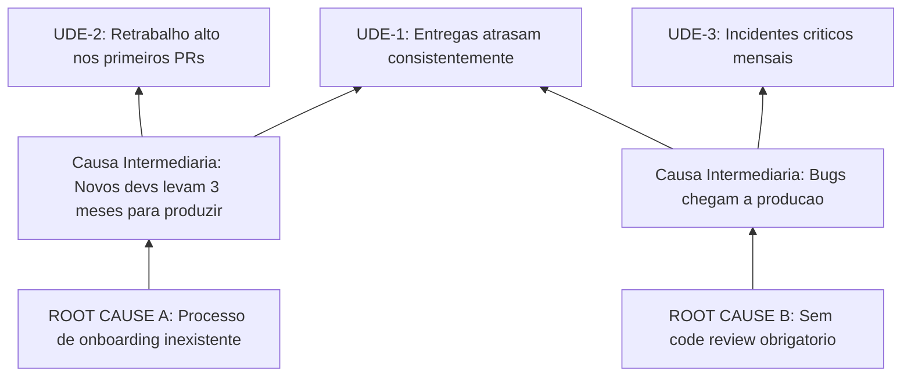

# deep-diagnosis.md — Diagnóstico Sistêmico Profundo

## Purpose

Executar análise sistêmica ou estrutural profunda do problema, usando o framework
apropriado ao domínio classificado. Problemas Complicated usam TOC/Current Reality Tree
(Goldratt); problemas Complex usam Soft Systems Methodology (Checkland). O objetivo
é mapear a cadeia causal completa ou o sistema de atividade relevante, produzindo um
diagnóstico que vá além dos sintomas.

**Agente responsável:** eli-goldratt (Complicated) OU peter-checkland (Complex)
**Fase:** 5 — Deep Diagnosis
**Frameworks:** TOC Thinking Processes / Soft Systems Methodology

---

## Task Metadata

```yaml
task_id: root-diagnosis/deep-diagnosis
task_name: Execute Deep Systemic Diagnosis
squad: root-diagnosis
type: deep-analysis
status: pending
responsible_executor: eli-goldratt OR peter-checkland
execution_type: Agent
version: "1.0.0"
estimated_duration: "30-60 min"
execution_mode: analytical
decision_routing:
  source: domain-classification.md
  complicated: eli-goldratt
  complex: peter-checkland
  both: sequential (goldratt first, then checkland)
```

---

## Inputs

```yaml
required:
  intake_brief:
    source: tasks/intake-triage.md → intake-brief.md
    required: true

  domain_classification:
    source: tasks/classify-domain.md → domain-classification.md
    required: true
    critical_field: primary_domain (determines agent routing)

  reframing_analysis:
    source: tasks/reframe-problem.md → reframing-analysis.md
    required: true
    critical_field: recommended_frame (use this, not original)

optional:
  cultural_diagnosis:
    source: tasks/diagnose-culture.md → cultural-diagnosis.md
  assumption_audit:
    source: tasks/audit-assumptions.md → assumption-audit.md
```

---

## Preconditions

- [ ] Todos os outputs anteriores disponíveis
- [ ] domain-classification.md determina qual agente executa
- [ ] Se reframe ocorreu, usar o novo problem statement
- [ ] Agente correto carregado conforme routing

---

## Action Items — Path A: Goldratt (Complicated Domain)

### Step A1: List Undesirable Effects (UDEs)

Extrair de todos os documentos anteriores os efeitos indesejáveis observáveis:

```yaml
udes:
  - id: "UDE-1"
    statement: "Descrição factual do efeito negativo"
    source: "Onde foi mencionado (intake, cultural, assumption)"
    observable: true/false
    frequency: "always | often | sometimes | rarely"
```

**Regra:** Mínimo 5 UDEs, máximo 15. Se menos de 5, reexaminar inputs.

### Step A2: Build Current Reality Tree (CRT)

Conectar UDEs em cadeia causal de baixo para cima:

```
UDE-1 → é causado por → Causa Intermediária 1 → é causado por → ROOT CAUSE A
UDE-2 → é causado por → Causa Intermediária 1 (mesma causa, múltiplos efeitos)
UDE-3 → é causado por → Causa Intermediária 2 → é causado por → ROOT CAUSE B
```

**Stopping criteria para CRT:** Parar quando atingir causa que é CONTROLAVEL e VERIFICAVEL — maximo 5 niveis de profundidade.

**Exemplo concreto de CRT (Mermaid):**



**Regras de suficiência lógica (CLR — Categories of Legitimate Reservation):**
- Clarity: Cada entidade está clara?
- Entity Existence: Cada entidade é factual?
- Causality Existence: A causalidade realmente existe?
- Cause Insufficiency: A causa é suficiente sozinha?
- Additional Cause: Existe causa adicional necessária?
- Cause-Effect Reversal: Causa e efeito estão na ordem certa?
- Predicted Effect Existence: Se a causa existe, o efeito previsto aparece?
- Tautology: A lógica é circular?

### Step A3: Identify Root Causes

As raízes da CRT (entidades sem causa upstream) são os root cause candidates:

```yaml
root_cause_candidates:
  - id: "RC-A"
    statement: "Causa-raiz candidata"
    udes_explained: ["UDE-1", "UDE-2", "UDE-4"]
    confidence: "High | Medium | Low"
    verification_needed: "O que verificar para confirmar"
```

### Step A4: Validate Cause-Effect Logic

Para cada conexão causal na CRT, verificar usando CLR. Marcar como:
- **Validated:** Lógica sólida
- **Weak:** Conexão plausível mas não confirmada
- **Challenged:** Possível inversão ou tautologia

---

## Action Items — Path B: Checkland (Complex Domain)

### Step B1: Build Rich Picture

Criar representação não-linear da situação problemática:

```yaml
rich_picture:
  actors: "Quem está envolvido e com que papel"
  structures: "Estruturas organizacionais/sociais relevantes"
  processes: "Processos formais e informais"
  concerns: "Preocupações expressas por cada ator"
  conflicts: "Tensões e conflitos visíveis e invisíveis"
  metaphors: "Metáforas que os atores usam para descrever a situação"
```

### Step B2: Identify Relevant Systems

**Stopping criteria para SSM:** Minimo 2, maximo 5 sistemas relevantes — priorizar por impacto no problema.

A partir do Rich Picture, identificar sistemas de atividade humana relevantes:

```yaml
relevant_systems:
  - id: "RS-1"
    description: "Sistema de atividade identificado"
    root_definition: "Transformação que este sistema realiza"
    relevance: "Por que este sistema é relevante para o problema"
```

### Step B3: Apply CATWOE to Each System

```yaml
catwoe:
  C_customers: "Quem recebe o output da transformação"
  A_actors: "Quem executa a transformação"
  T_transformation: "Input → Output (o que muda)"
  W_worldview: "Que visão de mundo torna esta transformação significativa"
  O_owners: "Quem pode parar/mudar o sistema"
  E_environment: "Restrições externas ao sistema"
```

### Step B4: Formulate Root Definitions

Para cada sistema relevante, criar Root Definition:

```
"Um sistema possuído por {O} e operado por {A} para transformar {T input} em {T output}
para benefício de {C}, dentro das restrições de {E}, baseado na premissa de que {W}."
```

### Step B5: Compare with Reality

Comparar os modelos conceituais com a situação real:
- Que atividades existem no modelo mas não na realidade?
- Que atividades existem na realidade mas não no modelo?
- As diferenças são o diagnóstico.

---

## Output

**Arquivo:** `squads/root-diagnosis/data/{problem-slug}/deep-diagnosis.md`

```yaml
output:
  deep_diagnosis:
    path_used: "goldratt | checkland | both"
    # Se Goldratt:
    goldratt_analysis:
      udes: []
      current_reality_tree: "Descrição textual ou mermaid da CRT"
      root_cause_candidates: []
      clr_validation: "Resultados da validação lógica"
    # Se Checkland:
    checkland_analysis:
      rich_picture: {}
      relevant_systems: []
      catwoe_analyses: []
      root_definitions: []
      model_vs_reality_gaps: []
    synthesis:
      key_findings: "Achados principais"
      systemic_patterns: "Padrões sistêmicos identificados"
      root_causes_preliminary: "Causas-raiz preliminares para aprofundamento"
```

---

## Acceptance Criteria

- [ ] Path correto executado conforme domain-classification
- [ ] **Goldratt:** Mínimo 5 UDEs listadas, CRT construída, CLR aplicada
- [ ] **Checkland:** Rich Picture completa, pelo menos 2 sistemas relevantes com CATWOE
- [ ] Root causes preliminares identificadas
- [ ] Lógica causal validada (sem tautologias ou inversões)

---

## Veto Conditions

```yaml
veto:
  condition_goldratt: "Menos de 3 UDEs identificáveis — dados insuficientes para CRT"
  condition_checkland: "Nenhum sistema de atividade relevante identificável"
  action: "HALT — Retornar para intake para coletar mais informação"
  recovery: "Re-executar intake-triage.md com perguntas mais específicas"
```

---

## Handoff

```yaml
handoff:
  next_task: root-cause-analysis.md
  executor: "kepner-tregoe OR dean-gano (conforme domain-classification.md)"
  passes:
    - Todos os outputs anteriores
    - deep-diagnosis.md
  condition: "deep-diagnosis.md gerado com root_causes_preliminary não-vazio"
  routing:
    isolable_deviation: kepner-tregoe
    multi_causal_chain: dean-gano
```

---

## Error Handling

```yaml
errors:
  phase_timeout:
    threshold: "20 min (individual phase)"
    action: "WARN ao usuario — oferecer simplificar escopo ou skip se fase opcional"
    recovery: "Salvar output parcial e documentar o que foi completado"

  contradictory_inputs:
    condition: "Output de fase anterior contradiz dados novos desta fase (ex: reframing mudou o frame mas dados do intake apontam para frame original)"
    action: "Documentar contradição — não ignorar silenciosamente"
    recovery: "Flaggar como 'data_conflict' no output e recomendar revisão na Phase 8 (stress test)"

  insufficient_data:
    condition: "Dados insuficientes para completar análise com confiança (ex: menos de 5 UDEs para Goldratt ou nenhum sistema relevante para Checkland)"
    action: "WARN — documentar o que falta e qual impacto na confiança"
    recovery: "Prosseguir com confidence=Low e flag para Phase 7 (quantificação)"

  agent_degradation:
    condition: "Agente não consegue aplicar framework adequadamente"
    action: "Fallback para root-diagnosis-chief com método simplificado"
    degradation: "Documentar como limitation no relatório final"
```

---

## Revision History

| Version | Date | Change |
|---------|------|--------|
| 1.0.0 | 2026-02-21 | Initial release — Dual-path (Goldratt CRT + Checkland SSM), CLR validation |
| 1.1.0 | 2026-02-22 | Add Error Handling section. Add CRT stopping criteria + Mermaid example. Add SSM stopping criteria (min 2, max 5 systems) |
